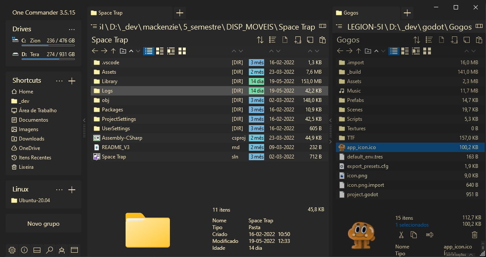

## Gruvbox Theme for One Commander
My humble attempt to create the **amazing** gruvbox theme for the [One Commander](https://www.onecommander.com/) File Manager (for windows).

### How to install?
Just copy the `Gruvbox` folder (in this repo) to the One Commander themes folder at `c:\Users\<your user name>\OneCommander\Themes` (if installed from Microsoft Store) or just `\Themes` folder for the portable version.

### Additional info
- Accent color: #44ebdbb2 (with alpha)
- Red: #fb4934
- Orange: #fe8019
- Yellow: #fabd2f
- Green: #b8bb26
- Blue: #83a598
- Purple: #d3869b
- Gray: #a89984
